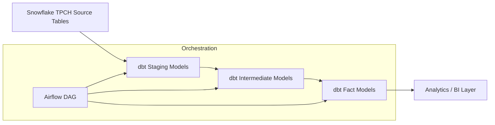

# 🚀 ELT Pipeline with dbt, Snowflake & Airflow (Astro)

This project demonstrates a **modern ELT pipeline** using:

* **dbt (data build tool)** for transformation
* **Snowflake** as the data warehouse
* **Apache Airflow (via Astronomer)** for orchestration

---

## 📊 Project Architecture

The pipeline extracts data from Snowflake’s sample `TPCH` dataset, transforms it using dbt models, and orchestrates execution with Airflow DAGs.

### High-level Architecture



---

## ⚙️ Setup Instructions

### 1. Clone the repository

```bash
git clone https://github.com/Janani03k/ELT-Orders-Data-Pipeline-with-DBT-Snowflake-Docker-and-Airflow.git
cd ELT-Orders-Data-Pipeline-with-DBT-Snowflake-Docker-and-Airflow
```

### 2. Snowflake Configuration

Run the following SQL to set up roles, warehouse, and schema in Snowflake:

```sql
use role accountadmin;

create warehouse if not exists dbt_wh with warehouse_size='xsmall';
create database if not exists dbt_db;
create role if not exists dbt_role;

show grants on warehouse dbt_wh;

grant usage on warehouse dbt_wh to role dbt_role;
grant role dbt_role to user <your_username>;
grant all on database dbt_db to role dbt_role;

use role dbt_role;

create schema if not exists dbt_db.dbt_schema;

grant create view on schema DBT_DB.DBT_SCHEMA to role dbt_role;
grant create table on schema DBT_DB.DBT_SCHEMA to role dbt_role;

grant select on table tpch.orders to role dbt_role;

```

### 3. Configure Airflow Connection

Add a Snowflake connection in Airflow (`snowflake_conn`):

* **Conn Id**: `snowflake_conn`
* **Conn Type**: `Snowflake`
* **Account**: `<your_snowflake_account>`
* **Warehouse**: `dbt_wh`
* **Database**: `dbt_db`
* **Role**: `dbt_role`
* **User/Password**: (your Snowflake credentials)

Alternatively, via CLI after running Docker Engine in the background:

```bash
astro dev start
astro dev bash
airflow connections add snowflake_conn \
    --conn-type snowflake \
    --conn-login '<USERNAME>' \
    --conn-password '<PASSWORD>' \
    --conn-extra '{"account": "<your_snowflake_account>", "warehouse": "dbt_wh", "database": "dbt_db", "role": "dbt_role"}'
```

### 4. Run the pipeline

```bash
astro dev start
```

Go to **[http://localhost:8080](http://localhost:8080)** → enable the DAG `dbt_dag` → Trigger Run.

---

## 📂 Repository Structure

```
.
├── dags/
│   ├── dbt_dag.py          # Airflow DAG definition
│   └── dbt/data_pipeline   # dbt project
│       ├── models/         # dbt models (staging, intermediate, fact)
|           ├── marts/      # tables
|           ├── staging/    # views from database
|       ├── macros/         # dbt macros (abstract complex logic, and standardize transformations)
│       ├── seeds/          # Seed files (if any)
│       └── dbt_project.yml # dbt project config
├── .gitignore              # Ignore sensitive configs
└── README.md
```

---

## 🌀 Airflow DAG

The DAG orchestrates dbt models in dependency order.

### DAG Graph & DAG Run History

Below are the DAGs implemented in this project:


* **stg\_tpch\_orders / stg\_tpch\_line\_items** → Staging models
* **int\_order\_items / int\_order\_items\_summary** → Intermediate aggregations
* **fct\_orders** → Final fact table

---

## 🔒 Security & Secrets

* **Do not commit credentials**.

* Add `.gitignore`:

  ```
  # Ignore dbt target files
  target/
  logs/
  .dbt/
  profiles.yml

  # Ignore Airflow logs & envs
  airflow/logs/
  airflow/unittests.cfg

  # Ignore secrets
  *.env
  ```

* Store credentials in:

  * **Airflow Connections** (recommended)
  * Or `.env` (but `.gitignore`d)

---

## ✅ Example DAG Run

The DAG successfully runs transformations and creates tables in Snowflake schema:

* **Staging:** `stg_tpch_orders`, `stg_tpch_line_items`
* **Intermediate:** `int_order_items`, `int_order_items_summary`
* **Fact:** `fct_orders`

---

## 📌 References

* [dbt Docs](https://docs.getdbt.com)
* [Astronomer (Airflow)](https://www.astronomer.io/docs)
* [Snowflake Docs](https://docs.snowflake.com)

